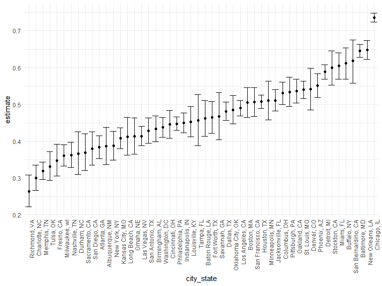
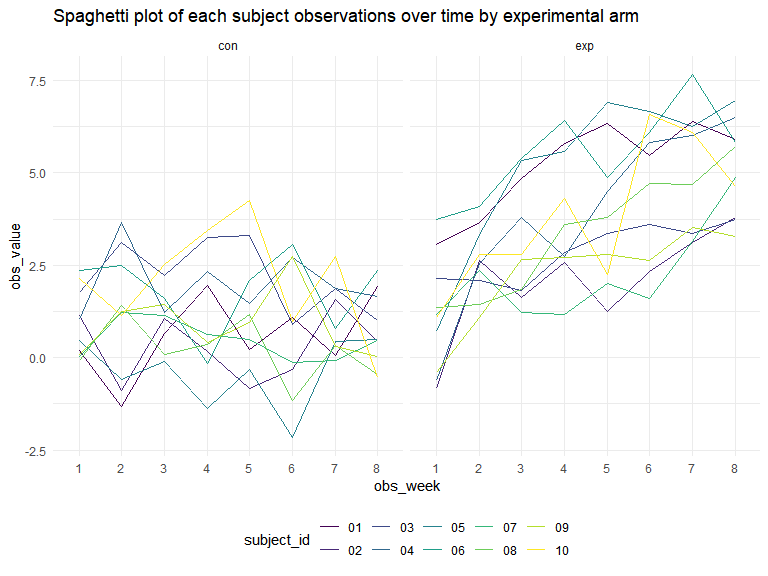
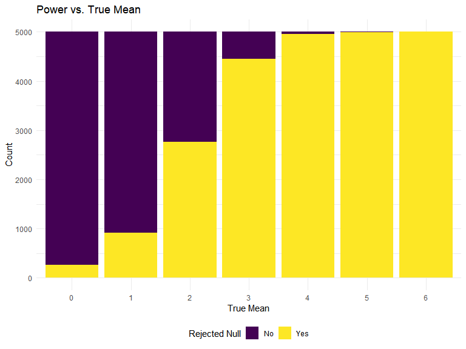
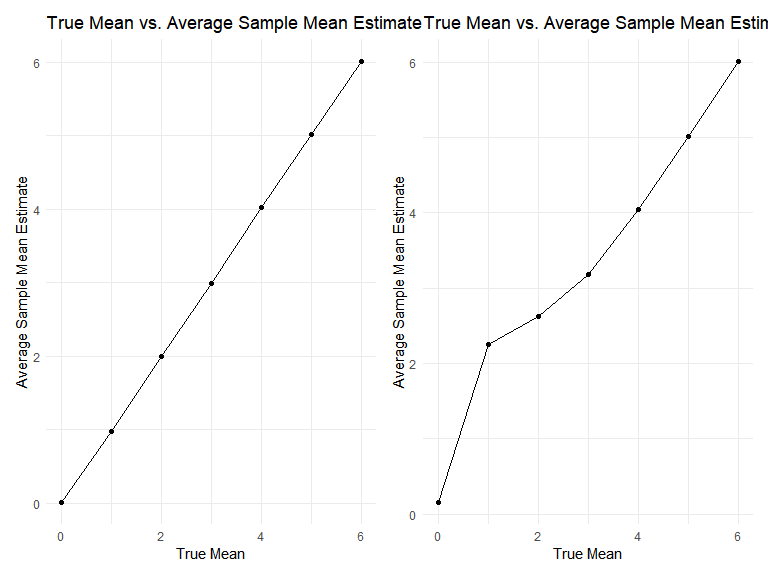

P8105 Homework 5
================
Madison Goldrich

Set seed for reproducibility.

``` r
set.seed(12345)
```

## Problem 1

For this problem, we are interested in data gathered and made public by
*The Washington Post* on homicides in 50 large U.S. cities. The code
chunk below imports and cleans the data.

``` r
homicide_df = 
  read_csv("data/homicide-data.csv", na = c("", "NA", "Unknown")) %>%
  mutate(
    city_state = str_c(city, state, sep = ", "),
    resolution = case_when(
      disposition == "Closed without arrest" ~ "unsolved",
      disposition == "Open/No arrest"        ~ "unsolved",
      disposition == "Closed by arrest"      ~ "solved"
    )
  ) %>% 
  filter(city_state != "Tulsa, AL") 
```

    ## Rows: 52179 Columns: 12
    ## ── Column specification ────────────────────────────────────────────────────────
    ## Delimiter: ","
    ## chr (8): uid, victim_last, victim_first, victim_race, victim_sex, city, stat...
    ## dbl (4): reported_date, victim_age, lat, lon
    ## 
    ## ℹ Use `spec()` to retrieve the full column specification for this data.
    ## ℹ Specify the column types or set `show_col_types = FALSE` to quiet this message.

The resulting dataframe has 52178 entries, on variables that include the
victim name, race, age, and sex; the date the homicide was reported; and
the location of the homicide. In cleaning, I created a `city_state`
variable that includes both city and state, and a `resolution` variable
to indicate whether the case was closed by arrest. I also excluded one
entry in Tulsa, AL, which is not a major US city and is most likely a
data entry error.

In the next code chunk, I group within cities and summarize to produce
the total number of homicides and the number that are solved.

``` r
city_homicide_df = 
  homicide_df %>% 
  select(city_state, disposition, resolution) %>% 
  group_by(city_state) %>% 
  summarize(
    hom_total = n(),
    hom_unsolved = sum(resolution == "unsolved"))
```

Focusing only on Baltimore, MD, I can use the `prop.test` and
`broom::tidy` functions to obtain an estimate and CI of the proportion
of unsolved homicides in that city. The table below shows those values.

``` r
bmore_test = 
  prop.test(
    x = filter(city_homicide_df, city_state == "Baltimore, MD") %>% pull(hom_unsolved),
    n = filter(city_homicide_df, city_state == "Baltimore, MD") %>% pull(hom_total)) 

broom::tidy(bmore_test) %>% 
  knitr::kable(digits = 3)
```

| estimate | statistic | p.value | parameter | conf.low | conf.high | method                                               | alternative |
|---------:|----------:|--------:|----------:|---------:|----------:|:-----------------------------------------------------|:------------|
|    0.646 |   239.011 |       0 |         1 |    0.628 |     0.663 | 1-sample proportions test with continuity correction | two.sided   |

Building on this code, I can use functions in the `purrr` package to
obtain estimates and CIs for the proportion of unsolved homicides in
each city in my dataset. The code below implements this analysis.

``` r
test_results = 
  city_homicide_df %>% 
  mutate(
    prop_tests = map2(hom_unsolved, hom_total, \(x, y) prop.test(x = x, n = y)),
    tidy_tests = map(prop_tests, broom::tidy)) %>% 
  select(-prop_tests) %>% 
  unnest(tidy_tests) %>% 
  select(city_state, estimate, conf.low, conf.high) %>% 
  mutate(city_state = fct_reorder(city_state, estimate))
```

Finally, I make a plot showing the estimate (and CI) of the proportion
of unsolved homicides in each city.

``` r
test_results %>% 
  mutate(city_state = fct_reorder(city_state, estimate)) %>% 
  ggplot(aes(x = city_state, y = estimate)) + 
  geom_point() + 
  geom_errorbar(aes(ymin = conf.low, ymax = conf.high)) + 
  theme(axis.text.x = element_text(angle = 90, hjust = 1))
```



This figure suggests a very wide range in the rate at which homicides
are solved – Chicago is noticeably high and, given the narrowness of the
CI, likely is the location of many homicides.

## Problem 2

For this problem, we are using data from longitudinal study that
included a control arm and an experimental arm.

Start with a dataframe containing all file names:

``` r
file_names_df =
  as_tibble(list.files(path = "data/prob2", full.names = TRUE))
```

Iterate over file names and read in data for each subject using
`purrr::map` and saving the result as a new variable in the dataframe:

``` r
longitudinal_df =
  file_names_df |> 
  mutate(data = map_dfr(file_names_df, read_csv))
```

    ## Rows: 20 Columns: 8
    ## ── Column specification ────────────────────────────────────────────────────────
    ## Delimiter: ","
    ## dbl (8): week_1, week_2, week_3, week_4, week_5, week_6, week_7, week_8
    ## 
    ## ℹ Use `spec()` to retrieve the full column specification for this data.
    ## ℹ Specify the column types or set `show_col_types = FALSE` to quiet this message.

Tidy the result:

``` r
longitudinal_df =
  longitudinal_df |> 
  mutate(
    arm = str_extract(value, "(con|exp)"),
    subject_id = str_extract(value, "(01|02|03|04|05|06|07|08|09|10)"),
    week_1 = data$week_1,
    week_2 = data$week_2,
    week_3 = data$week_3,
    week_4 = data$week_4,
    week_5 = data$week_5,
    week_6 = data$week_6,
    week_7 = data$week_7,
    week_8 = data$week_8,
  ) |> 
  select(arm, subject_id, week_1:week_8) |> 
  pivot_longer(
    week_1:week_8,
    names_to = "obs_week",
    values_to = "obs_value"
  ) |> 
  mutate(obs_week = str_replace(obs_week, "week_", ""))
```

I pivoted longer in order to make the below spaghetti plot!

``` r
longitudinal_df |> 
  ggplot(aes(x = obs_week, y = obs_value, color = subject_id)) +
  geom_line(aes(group = subject_id)) +
  facet_grid(. ~ arm) +
  labs(
    title = "Spaghetti plot of each subject observations over time by experimental arm")
```



The observations of the subjects in the control arm appeared to stay
fairly consistent over the 8 week observation period, with some
fluctuation. The subjects in the experimental group saw a general
increase in the measured observation value over the 8 week period. We
can infer that the experimental exposure has a positive association with
the outcome of interest.

## Problem 3

Run the simulation with mu = 0.

``` r
sim_t_test = function(mu, n_obs = 30, sigma = 5) {
  
  sim_data = tibble(
    x = rnorm(n = n_obs, mean = mu, sd = sigma)
  )
  
  t_test_result = 
    t.test(sim_data) |> 
    broom::tidy() |> 
    select(estimate, p.value)

}

sim_results_df =
  expand_grid(
    mu = 0,
    iter = 1:5000
  ) |> 
  mutate(
    t_test_df = map(mu, sim_t_test)
  ) |> 
  unnest(t_test_df)
```

Repeat for mu = {1, 2, 3, 4, 5, 6}.

``` r
sim_results_df =
  expand_grid(
    mu = c(0, 1, 2, 3, 4, 5, 6),
    iter = 1:5000
  ) |> 
  mutate(
    t_test_df = map(mu, sim_t_test)
  ) |> 
  unnest(t_test_df)
```

Make a plot showing the proportion of times the null was rejected
(power) and the true value of mu on the x axis.

``` r
sim_results_df =
  sim_results_df |> 
  mutate(
    reject_null = case_when(
      p.value < 0.05  ~ "Yes",
      p.value >= 0.05 ~ "No"))

sim_results_df |> 
  ggplot(aes(x = factor(mu), fill = reject_null)) +
  geom_bar(stat = "count", position = "stack") +
  labs(
    title = "Power vs. True Mean",
    x = "True Mean",
    y = "Count",
    fill = "Rejected Null")
```



The above plot shows that power increases with effect size. As the true
mean increases from 0, so does the likelihood of rejecting the null
hypothesis of mu = 0.

``` r
true_vs_sample_plot = 
  sim_results_df |> 
  group_by(mu) |> 
  summarize(
    mean_estimate = mean(estimate)) |> 
  ggplot(aes(x = mu, y = mean_estimate)) +
  geom_point() +
  geom_line() +
  labs(
    title = "True Mean vs. Average Sample Mean Estimate",
    x = "True Mean",
    y = "Average Sample Mean Estimate")

rejected_null_plot =
  sim_results_df |> 
  filter(reject_null == "Yes") |> 
  group_by(mu) |> 
  summarize(
    mean_estimate = mean(estimate)) |> 
  ggplot(aes(x = mu, y = mean_estimate)) +
  geom_point() +
  geom_line() +
  labs(
    title = "True Mean vs. Average Sample Mean Estimate (Null Rejected)",
    x = "True Mean",
    y = "Average Sample Mean Estimate")

true_vs_sample_plot + rejected_null_plot
```



The above plots show the average sample mean estimate vs. the true mean,
among all samples and only among samples for which the null hypothesis
was rejected. In the latter subset, when the true mean is low (mu = 1 or
2), the average sample mean estimate is slightly greater than the true
mean. This is because these tests have less power, so it takes a larger
sample mean to reject the null.
